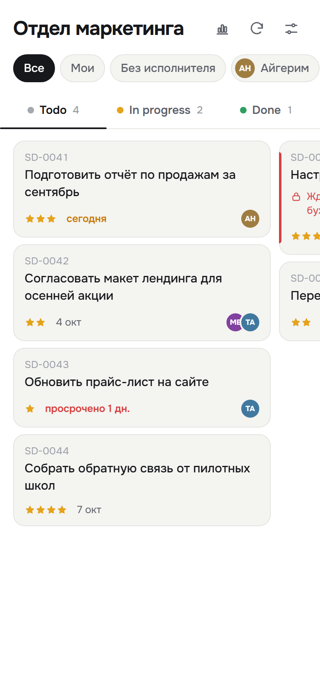
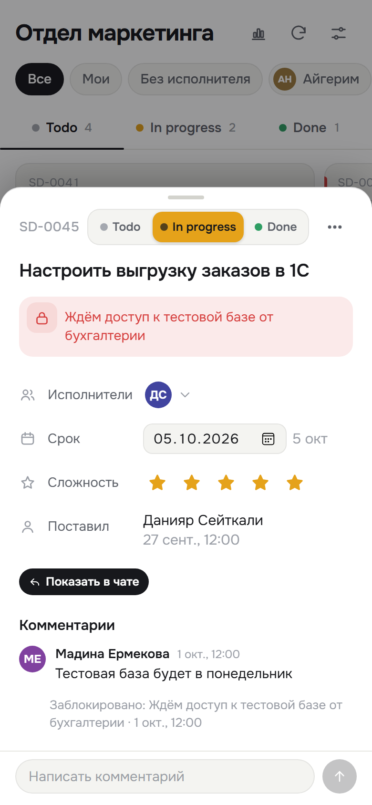
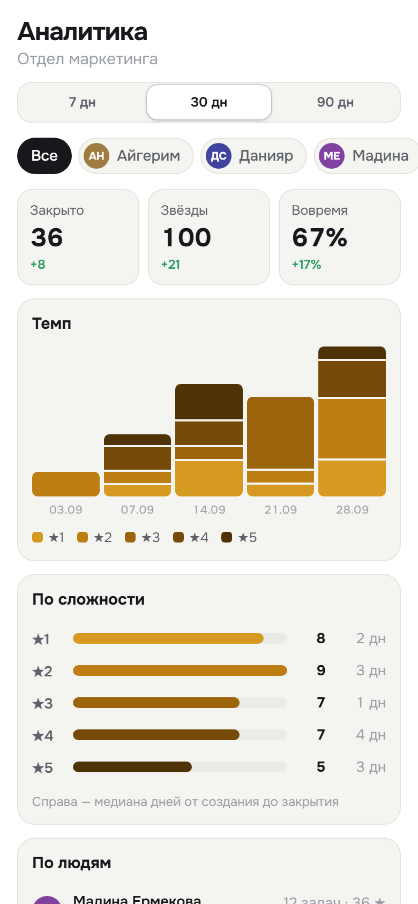
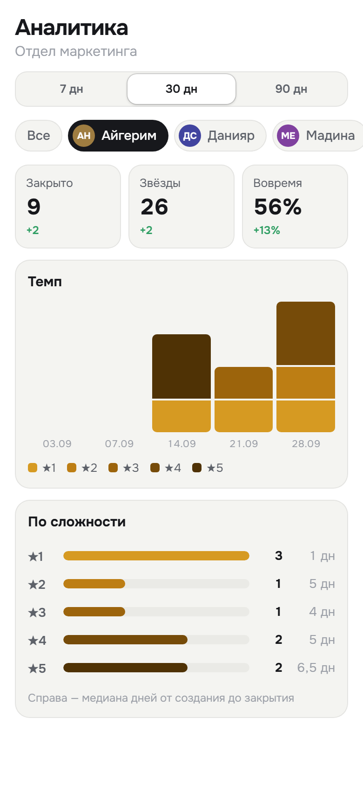
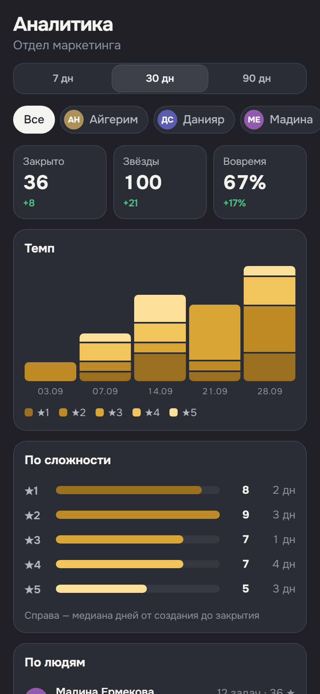

# kanbot

Задачи прямо из Telegram-чата. Бот ставит задачу командой в группе, а доска внутри Telegram (Mini App) показывает их в колонках Todo / In progress / Done, с карточками, комментариями и аналитикой.

<p>
  
  
  
</p>

## Как это работает

1. Бота добавляют в группу, админ включает её в админке.
2. В группе пишут `/task @user текст задачи` — или отвечают на любое сообщение `/task @user`, тогда текстом задачи станет это сообщение.
3. Бот отвечает «Задача SD-0042 создана» с кнопкой «Открыть доску», исполнитель получает уведомление в личку.
4. Дальше задача живёт на доске: её двигают между колонками, меняют срок, сложность, исполнителей, комментируют. Комментарии из доски бот публикует в группе цитатой к исходному сообщению.

Каждое утро в 09:00 (Алматы) бот присылает исполнителям дайджест: что сегодня в срок и что просрочено.

## Доска


- Три колонки с горизонтальной прокруткой и перетаскиванием карточек.
- Фильтр по исполнителю: все, мои, без исполнителя, конкретный человек.
- На карточке — номер, текст, звёзды сложности, срок (сегодня / просрочено подсвечиваются) и аватарки исполнителей.
- Сортировка и показ давно закрытых задач — в настройках доски.

<br clear="right">

## Карточка задачи


- Переключатель статуса с цветными метками: Todo, In progress (жёлтый), Done (зелёный).
- Исполнители — тап по аватаркам открывает список участников с галочками.
- Срок, сложность от 1 до 5 звёзд, кто поставил и когда.
- «Показать в чате» открывает исходное сообщение в группе.
- «Заблокировать» с причиной; блок снимается тапом по замочку в плашке.
- Удаление спрятано в меню «⋯» и требует подтверждения.

<br clear="right">

## Аналитика

<p>
  
  
  
</p>

Открывается иконкой графика в шапке доски. Период — 7, 30 или 90 дней, фильтр — по исполнителю.

- **Закрыто, Звёзды, Вовремя** — сколько задач закрыто, их суммарная сложность и доля закрытых не позже срока. Под числом — изменение к прошлому такому же периоду.
- **Темп** — закрытые задачи по дням (7 дней) или неделям, каждый столбик разбит по сложности. Тап по столбику показывает расшифровку.
- **По сложности** — сколько закрыто задач каждой сложности и медиана дней от создания до закрытия.
- **По людям** — вклад каждого исполнителя с разбивкой по звёздам. Задача с несколькими исполнителями учитывается у каждого.

Время считается от создания задачи до перевода в Done. Если задачу вернуть из Done, она выпадает из статистики до повторного закрытия.

## Права

- Доску и аналитику видят участники группы.
- Ставить задачи могут все участники или только выбранные — настраивается в админке для каждой группы.
- Двигать задачу и менять срок, сложность, исполнителей могут постановщики группы и исполнители задачи; текст — постановщики и автор; удалить — автор или супер-админ. Права проверяются на сервере.
- Админка (`/admin` или раздел внутри Mini App) — для супер-админов: включение групп и выбор постановщиков. Вход по 4-значному коду, который присылает бот.

## Стек

Next.js (App Router, TypeScript) на Vercel · Supabase Postgres через Drizzle · grammY для вызовов Bot API · @dnd-kit · Vitest.

Часовой пояс всей логики дат — `Asia/Almaty`.

## Разработка

```bash
npm install
cp .env.example .env.local   # заполнить значения
npm run dev
```

| Команда | Что делает |
|---|---|
| `npm test` | юнит-тесты (`src/domain/**`, чистая логика без I/O) |
| `npm run typecheck` | проверка типов |
| `npm run build` | сборка |
| `npm run db:generate` / `npm run db:migrate` | миграции Drizzle |
| `npm run webhook:set` | установить webhook бота на `APP_URL` |
| `npm run bot:profile` | описание бота и меню команд |

Переменные окружения (`.env.local`, в git не попадает):

| Имя | Назначение |
|---|---|
| `TELEGRAM_BOT_TOKEN` | токен бота |
| `TELEGRAM_BOT_USERNAME` | username бота без `@` |
| `TELEGRAM_WEBHOOK_SECRET` | секрет заголовка webhook |
| `TELEGRAM_MINIAPP_SHORT_NAME` | short name Mini App из BotFather |
| `DATABASE_URL` | Postgres (transaction pooler) |
| `MIGRATION_DATABASE_URL` | Postgres для миграций (session/direct) |
| `SUPERADMIN_IDS` | Telegram ID супер-админов через запятую |
| `CRON_SECRET` | авторизация вызова дайджеста |
| `SESSION_SECRET` | подпись сессий админки и хеширование кодов входа |
| `APP_URL` | публичный адрес приложения |

Структура:

- `src/domain/` — бизнес-логика без БД и сети, покрыта тестами
- `src/server/` — работа с БД и правами
- `src/app/api/` — HTTP-эндпоинты (webhook бота, API Mini App, админка, cron)
- `src/miniapp/` — интерфейс Mini App
- `src/telegram/` — тексты и отправка сообщений бота

Дизайн и планы — в `docs/superpowers/`. Скриншоты в README сделаны на демо-данных.
